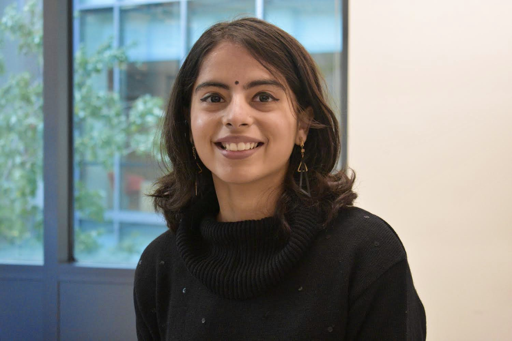

# [Devishi Kesar](https://devishi.github.io/)

## Contents
- [About Me](#about)
- [Research](#research)
- [CV](https://devishi.github.io/assets/resume/Resume.pdf) 
- [Contact](#contact)

## About Me

I am a second-year graduate student in the division of Pediatric Glioma Research, working in the area of bioinformatics supervised by Dr. David T.W. Jones and Dr. RJ Autry. Before joining as a graduate student, I worked a computational associate at the broad institute in Sellers lab. I did my Masters in Bioinformatics at Georgia Institute of technology was an undergraduate at Indraprastha Institute of Information Technology, Delhi (IIIT-Delhi) where I earned a major in Computer science and engineering and a minor in Computational biology. 

My current research focuses on understanding pediatric gliomas, a type of brain tumor in children. I analyze patient data to study how specific proteins and genetic factors interact using ChIP-Seq data. I have been working on mapping super-enhancer regions across glioma subtypes, identifying key regulatory elements and transcription factors that may drive tumor initiation and progression. To interpret these findings within a multi-omic framework, I integrated RNA-Seq, DNA methylation, and copy number alteration data using graph auto-encoders to learn high-dimensional representations across these modalities.  This would enable the discovery of interconnected biomarker networks, predictive modeling of regulatory interactions, and identification of previously unrecognized oncogenic circuits.

Outside of work, I enjoy reading, exploring new cities, listening to music, and playing basketball.

## Research

## Contact

The best way to reach me via email is devishi[dot]kesar[at]kitz-heidelberg.de
